# Rule-Based Game Recommendation System - Implementation

## Overview
The system generates recommendations inside `App\Actions\Recommendations\BuildGameRecommendations::handle(?User $viewer)` using deterministic rule-based logic over a viewer's **favorite games** and **high-rated reviews**. Recommendations are returned as part of the JSON payload for `GET /api/posts` via `App\Http\Controllers\Api\PostController@index` (`$payload['recommendations'] = ...`).

There is no standalone `GET /api/recommendations` endpoint in `routes/api.php`.

## Scoring Logic
All recommendation scoring happens inside `BuildGameRecommendations::handle()`. The action computes per-candidate scores for two independent strategies, ranks them deterministically, applies diversity filters, and then creates one merged recommendation list for the frontend.

### Favorites-based scoring
1. Build weights from the viewer's favorite games:
   - `favoriteGenreWeights[genre_id]` = count of that genre across all favorite games
   - `favoritePlatformWeights[platform_id]` = count of that platform across all favorite games
2. Candidate set:
   - excludes games already in the viewer's favorites (`whereNotIn('id', $excludedGameIds)`)
   - loads `genres`, `platforms`, `reviews_count`, and `reviews_avg_rating`
3. Per-candidate favorite overlap score:
   - for each shared genre:
     - `favoriteScore += 2 * favoriteGenreWeights[genre_id]`
   - for each shared platform:
     - `favoriteScore += favoritePlatformWeights[platform_id]`
4. Community tie-breaker:
   - `communityTieBreaker = int(round((reviews_avg_rating ?? rating ?? 0) / 2))`
   - final: `favorite_score = favoriteScore + communityTieBreaker`

### Review-based scoring
1. Build weights from the viewer's high-rated reviews (`rating >= 8`)
2. For each high-rated review:
   - `weight = max(1, (int) (review->rating - 7))`
   - add `weight` to all genres and platforms of the reviewed game
3. Per-candidate review overlap score:
   - for each shared genre:
     - `reviewScore += 2 * reviewGenreWeights[genre_id]`
   - for each shared platform:
     - `reviewScore += reviewPlatformWeights[platform_id]`
4. Community tie-breaker:
   - `communityTieBreaker = int(round((reviews_avg_rating ?? rating ?? 0) / 2))`
   - final: `review_score = reviewScore + communityTieBreaker`

### Deterministic ranking and tie-breaking
Before candidate selection, `sortCandidatesDeterministically()` ranks candidates using:
- strategy score descending
- average review rating descending
- game rating descending
- game name ascending
- game id ascending

This removes randomness and makes equal-score ordering stable.

### Candidate selection and diversity
After sorting, `selectDiverseCandidates()` is applied separately for each strategy:
- Favorites limit: `FAVORITES_RECOMMENDATION_LIMIT = 10`
- Reviews limit: `REVIEW_RECOMMENDATION_LIMIT = 6`

Diversity rules avoid near-duplicate results by checking:
- normalized franchise key
- primary genre
- repeated explanation text
- repeated favorite source for favorites-based recommendations

### Deterministic merged results
After favorites-based and review-based recommendation lists are built, `mergeRecommendationsDeterministically()` combines them into one merged list:
- duplicate games are merged by `id`
- scores are combined
- reasons are de-duplicated
- the explanation from the strongest contributing strategy is kept
- final merged ranking is sorted by:
  - merged score descending
  - game name ascending
  - game id ascending

The frontend now uses this merged list as the main recommendation display.

## Explainability
Explainability is produced directly in `BuildGameRecommendations` as:
- `recommendation_reasons` (array)
- `recommendation_explanation` (string)

### `recommendation_reasons` generation
Reasons are dynamically generated from actual overlaps:
- Favorites-based reasons:
  - shared genres
  - shared platforms
- Review-based reasons:
  - genres from high-rated reviews
  - platforms from high-rated reviews

The serialized output de-duplicates reasons with:
- `array_values(array_unique($reasons))`

### `recommendation_explanation` generation
Favorites explanation:
1. If a best matching favorite source exists:
   - `Because you favorited {source name} ({signals}).`
2. Else if shared favorite genres exist:
   - `Because it shares genres you often favorite...`
3. Else if shared favorite platforms exist:
   - `Because it matches platforms from your favorite games...`
4. Else:
   - generic favorites similarity explanation

Review explanation:
1. If shared review genres exist:
   - `Popular among players who like ...`
2. Else if shared review platforms exist:
   - `Matches platforms from games you rated highly...`
3. Else:
   - generic review-pattern explanation

## Cold Start Handling
Cold start is handled by `buildFallbackRecommendations()` when:
- the viewer is `null`, or
- both favorites and reviews signals are missing

### Fallback strategy
Fallback recommendations are based on popularity/trending signals:
- ordered by `reviews_avg_rating desc`
- then `rating desc`
- then `name asc`
- then `id asc`

Returned fallback output includes:
- `favorites_based_similarity`
- `review_based_similarity`
- `merged_similarity`

### Guaranteed non-empty response
If the game catalog itself is empty, the action returns a placeholder recommendation:
- `Game catalog is still being prepared`

This guarantees that recommendation output is never empty.

### Partial cold start
If only one strategy has insufficient signals:
- favorites-based falls back independently
- review-based falls back independently

This allows the system to stay partially personalized instead of failing completely.

## Weekly Email Subscription UX (Frontend)
The Posts page includes a subscription callout above **Recommended for You** so users can opt in or out without opening Settings.

Implemented in:
- `frontend/src/app/posts/page.tsx`

Behavior:
- loads current preference from `GET /auth/me`
- shows a weekly email CTA
- updates preference through `PUT /auth/profile`
- updates React Query cache after success
- displays inline error text if loading or update fails

## Frontend Recommendation Display
The frontend recommendation UI is implemented in:
- `frontend/src/app/posts/page.tsx`

The page:
- fetches recommendations from `GET /api/posts`
- renders a **Recommended for You** section
- displays the merged recommendation list
- shows:
  - game name
  - image
  - recommendation score
  - recommendation explanation
  - recommendation reasons
- includes loading and error handling for the feed and subscription toggle

## System Flow (Mermaid)

```mermaid
sequenceDiagram
  participant UI as UI (Next.js)
  participant API as Laravel API
  participant PostController as PostController@index
  participant AuthController as AuthController
  participant RecAction as BuildGameRecommendations Action
  participant DB as Database (Eloquent)
  participant Scheduler as Laravel Scheduler
  participant ConsoleCmd as recommendations:send-weekly
  participant Mail as WeeklyRecommendationsMail
  participant WebRoute as recommendations.unsubscribe
  participant User as User Inbox/Browser

  rect rgb(15, 23, 42)
  Note over UI,DB: Feed + recommendation generation
  UI->>API: GET /api/posts
  API->>PostController: index(request)
  PostController->>RecAction: handle(viewer)

  alt viewer missing or no signals
    RecAction->>DB: query fallback games
    RecAction->>RecAction: build fallback results
  else personalized candidates
    RecAction->>DB: load favorite games
    RecAction->>DB: load high-rated reviews
    RecAction->>DB: query candidate games
    RecAction->>RecAction: score strategies
    RecAction->>RecAction: sort and merge deterministically
  end

  alt strategy list empty
    RecAction->>DB: reuse fallback list
    RecAction->>RecAction: apply fallback messages
  end

  RecAction-->>PostController: recommendations object
  PostController-->>UI: JSON posts + recommendations
  end

  rect rgb(12, 32, 45)
  Note over UI,DB: In-app subscribe/unsubscribe toggle
  UI->>API: GET /auth/me
  API->>AuthController: me()
  AuthController->>DB: load user
  AuthController-->>UI: user.weekly_recommendation_emails
  UI->>API: PUT /auth/profile
  API->>AuthController: updateProfile()
  AuthController->>DB: persist preference
  AuthController-->>UI: updated user
  end

  rect rgb(32, 20, 20)
  Note over Scheduler,User: Weekly email pipeline + unsubscribe
  Scheduler->>ConsoleCmd: run weeklyOn(1, 09:00)
  ConsoleCmd->>DB: query verified + subscribed users
  loop each eligible user
    ConsoleCmd->>RecAction: handle(user)
    RecAction-->>ConsoleCmd: recommendations
    ConsoleCmd->>Mail: build mail + signed unsubscribe URL
    Mail-->>User: weekly recommendation email
  end
  User->>WebRoute: click unsubscribe link
  WebRoute->>DB: set weekly_recommendation_emails = false
  WebRoute-->>User: redirect to app login with unsubscribed state
  end
```

