# Rule-Based Game Recommendation System – Implementation

## Overview
The system generates recommendations inside `App\Services\GameRecommendationService::buildForUser(?User $viewer)` using rule based logic over a viewer’s **favorite games** and **high-rated reviews**. Recommendations are returned as part of the JSON payload for `GET /api/posts` via `App\Http\Controllers\Api\PostController@index` (`$payload['recommendations'] = ...`)

There is no standalone `GET /api/recommendations` endpoint in `routes/api.php`.

## Scoring Logic
All scoring happens in `GameRecommendationService::buildForUser()`. The service computes per candidate scores for two independent strategies, then selects a diverse subset for each.

### Favorites-based scoring
1. Build a platform corresponding to the games in users "Favourites":
   - `favoriteGenreWeights[genre_id]` = count of that genre across all favorite games
   - `favoritePlatformWeights[platform_id]` = count of that platform across all favorite games
2. Candidate set:
   - considers games not already in the viewer’s favorites (`whereNotIn('id', $excludedGameIds)`)
   - loads candidate `genres`, `platforms`, plus `reviews_avg_rating` (`withAvg('reviews', 'rating')`)
3. Per-candidate favorite overlap score:
   - for each candidate genre that exists in `favoriteGenreWeights`:
     - `favoriteScore += 2 * favoriteGenreWeights[genre_id]`
   - for each candidate platform that exists in `favoritePlatformWeights`:
     - `favoriteScore += favoritePlatformWeights[platform_id]`
4. Community tie-breaker (added to favorites score too):
   - `communityTieBreaker = int(round((reviews_avg_rating ?? rating ?? 0) / 2))`
   - final: `favorite_score = favoriteScore + communityTieBreaker`

### Review-based scoring
1. Build genre/platform weights from the viewer’s **high-rated reviews** (`rating >= 8`):
   - for each high-rated review:
     - `weight = max(1, (int) (review->rating - 7))`
     - add `weight` to all genres and platforms of the reviewed game:
       - `reviewGenreWeights[genre_id] += weight`
       - `reviewPlatformWeights[platform_id] += weight`
2. Per-candidate review overlap score:
   - for each candidate genre that exists in `reviewGenreWeights`:
     - `reviewScore += 2 * reviewGenreWeights[genre_id]`
   - for each candidate platform that exists in `reviewPlatformWeights`:
     - `reviewScore += reviewPlatformWeights[platform_id]`
3. Community tie-breaker (added to reviews score too):
   - `communityTieBreaker = int(round((reviews_avg_rating ?? rating ?? 0) / 2))`
   - final: `review_score = reviewScore + communityTieBreaker`

### Candidate selection (diversity + filters)
For each strategy independently:
- Favorites-based picks are taken from candidates where:
  - `favorite_score > 0`
  - `favorite_reasons` is not empty
- Review-based picks are taken from candidates where:
  - `review_score > 0`
  - `review_reasons` is not empty

After sorting by score desc, `selectDiverseCandidates()` is applied with different limits:
- Favorites: `FAVORITES_RECOMMENDATION_LIMIT = 10`
- Reviews: `REVIEW_RECOMMENDATION_LIMIT = 6`

Diversity rules skip candidates if they share any of:
- normalized “franchise key” (`franchiseKey($game->name)`)
- the candidate’s `primaryGenre` (first genre’s `slug`, else name)
- the candidate’s explanation string (strategy-specific)
- for favorites strategy only: same `favorite_source_id` (the “best matching” favorited game)

## Explainability
Explainability is produced in `GameRecommendationService` as:
- `recommendation_reasons` (array)
- `recommendation_explanation` (string)

### `recommendation_reasons` generation
For each candidate game, reasons are added based on what overlaps exist:
- Favorites-based reasons:
  - If shared favorite genres exist:
    - `Favorites-based: shared genres ({first 2 shared genre names}).`
  - If shared favorite platforms exist:
    - `Favorites-based: shared platforms ({first 2 shared platform names}).`
- Review-based reasons:
  - If shared high-rated genres exist:
    - `Review-based: matches highly rated genres ({first 2 shared genre names}).`
  - If shared high-rated platforms exist:
    - `Review-based: matches platforms from your highest-rated reviews ({first 2 shared platform names}).`

The serialized output de-duplicates reasons:
- `recommendation_reasons = array_values(array_unique($reasons))`

### `recommendation_explanation` generation
Favorites explanation (`buildFavoritesExplanation()`):
1. If a “best matching favorited game” exists (computed by `resolveFavoriteSource()`):
   - `Because you favorited {source name} ({first 2 signals}).`
   - `signals` are up to two tokens from:
     - overlapped shared genres + overlapped shared platforms
2. Else if shared favorite genres exist:
   - `Because it shares genres you often favorite, like {first 2 sharedGenres}.`
3. Else if shared favorite platforms exist:
   - `Because it matches platforms from your favorite games, like {first 2 sharedPlatforms}.`
4. Else:
   - `Because it is similar to the games you have favorited.`

Review explanation (`buildReviewExplanation()`):
1. If shared genres exist:
   - `Popular among players who like {first 2 sharedGenres} games.`
2. Else if shared platforms exist:
   - `Matches platforms from games you rated highly, like {first 2 sharedPlatforms}.`
3. Else:
   - `Recommended from patterns in your highest-rated reviews.`

### Fallback explanation strings (partial + full)
When recommendations fall back, the service overwrites explanation and reasons for those returned games:
- Favorites fallback reasons:
  - `Fallback: shown because there is not enough favorites history yet.`
  - explanation: `Trending this week based on community favorites and reviews.`
- Reviews fallback reasons:
  - `Fallback: shown because there is not enough high-rated review history yet.`
  - explanation: `Popular among players with similar tastes in highly rated games.`
- Full fallback reasons:
  - `Fallback: shown because there is not enough favorites/review history yet.`
  - explanation: `Trending this week based on community favorites and reviews.`

### Frontend display copy for recommendation cards
In `frontend/src/app/posts/page.tsx`, the recommendation cards currently display a normalized user-facing line instead of the raw `recommendation_explanation` value:
- `Get started on this week's most viewed games to play.`

This is a presentational override in the UI; backend explanation generation is still returned in the API payload.

## Cold Start Handling
Cold start is handled by returning fallback recommendations when a viewer has no usable interaction signals.

### Full cold start
If `buildForUser()` receives `null` viewer OR if both signal sets are empty:
- `!hasFavoritesSignals && !hasReviewSignals`

Then `buildFallbackRecommendations()` is used:
- loads games ordered by:
  - `reviews_avg_rating desc`
  - then `rating desc`
- takes up to `FALLBACK_RECOMMENDATION_LIMIT = 10`
- score:
  - `score = max(1, int(round((reviews_avg_rating ?? rating ?? 0) * 2)))`
- sets:
  - `insufficient_data = true`
  - `favorites_based_similarity` and `review_based_similarity` to the same fallback list

### Partial cold start (strategy-level fallback)
After personalization:
- If favorites strategy returns no picks, it is replaced by `favorites_based_similarity` fallback:
  - fallback list `take(10)`
  - favorites fallback reasons + explanation
- If review strategy returns no picks, it is replaced by `review_based_similarity` fallback:
  - fallback list `take(6)`
  - review fallback reasons + explanation

In the final response, `insufficient_data` is:
- `!$hasFavoritesSignals || !$hasReviewSignals`

## Weekly Email Subscription UX (Frontend)
The Posts page now includes a subscription callout above **Recommended for You** so users can opt in/out without opening Settings.

Implemented in:
- `frontend/src/app/posts/page.tsx`

Behavior:
- Loads current preference from `GET /auth/me` (`weekly_recommendation_emails`)
- Shows CTA text:
  - `Want to stay on top of trending games based on your favorites and reviews? Subscribe and we'll send you a weekly recommendation email.`
- Renders a toggle button with state-aware label:
  - `Subscribe to weekly emails` when disabled
  - `Unsubscribe from weekly emails` when enabled
- Persists preference via `PUT /auth/profile` by sending:
  - `name`, `username`, `email`, `bio`, `weekly_recommendation_emails`
- Updates React Query cache (`['me']`) after success so UI updates immediately.

## System Flow (Mermaid)

```mermaid
sequenceDiagram
  participant UI as UI (Next.js)
  participant API as Laravel API
  participant PostController as PostController@index
  participant AuthController as AuthController
  participant RecService as GameRecommendationService
  participant Scheduler as Laravel Scheduler
  participant ConsoleCmd as recommendations:send-weekly
  participant Mail as WeeklyRecommendationsMail
  participant WebRoute as recommendations.unsubscribe
  participant DB as Database (Eloquent)
  participant User as User Inbox/Browser

  rect rgb(15, 23, 42)
  Note over UI,DB: Feed + recommendation generation
  UI->>API: GET /api/posts
  API->>PostController: index(request)
  PostController->>RecService: buildForUser(viewer)

  alt viewer missing or no signals
    RecService->>DB: query fallback games
    RecService->>RecService: compute fallback scores
  else personalized candidates
    RecService->>DB: load favorite games
    RecService->>DB: load high-rated reviews
    RecService->>DB: query candidate games
    RecService->>RecService: score overlaps
    RecService->>RecService: select diverse picks
  end

  alt strategy list empty
    RecService->>DB: reuse fallback list
    RecService->>RecService: apply fallback messages
  end

  RecService-->>PostController: recommendations object
  PostController-->>UI: JSON posts + recos
  end

  rect rgb(12, 32, 45)
  Note over UI,DB: In-app subscribe/unsubscribe toggle (Posts page CTA)
  UI->>API: GET /auth/me
  API->>AuthController: me()
  AuthController->>DB: load user
  AuthController-->>UI: user.weekly_recommendation_emails
  UI->>API: PUT /auth/profile (weekly_recommendation_emails)
  API->>AuthController: updateProfile()
  AuthController->>DB: persist preference
  AuthController-->>UI: updated user
  end

  rect rgb(32, 20, 20)
  Note over Scheduler,User: Weekly email pipeline + one-click unsubscribe
  Scheduler->>ConsoleCmd: run weeklyOn(1, 09:00)
  ConsoleCmd->>DB: query verified + subscribed users
  loop each eligible user
    ConsoleCmd->>RecService: buildForUser(user)
    RecService-->>ConsoleCmd: recommendations
    ConsoleCmd->>Mail: build mail + signed unsubscribe URL
    Mail-->>User: weekly recommendation email
  end
  User->>WebRoute: click unsubscribe link
  WebRoute->>DB: set weekly_recommendation_emails = false
  WebRoute-->>User: redirect to app login with unsubscribed state
  end
```

